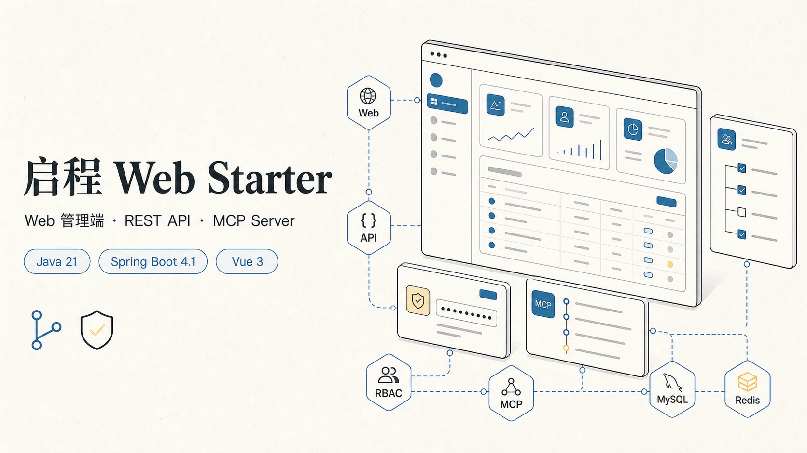
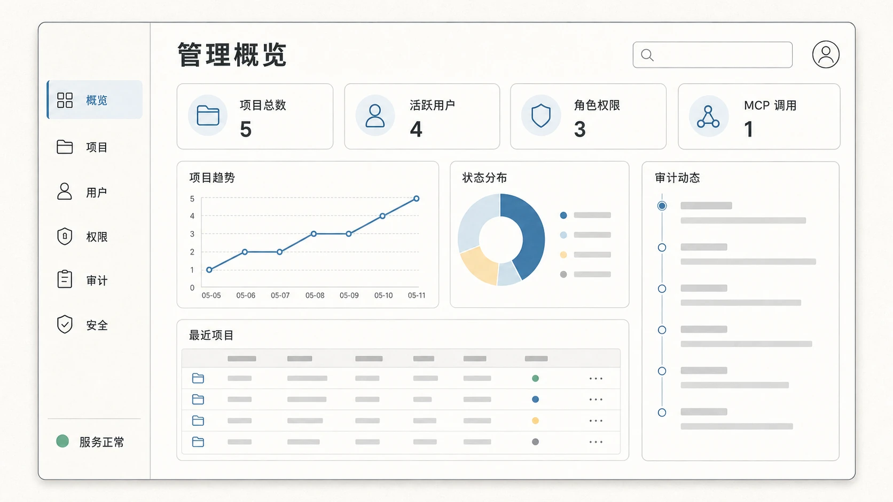
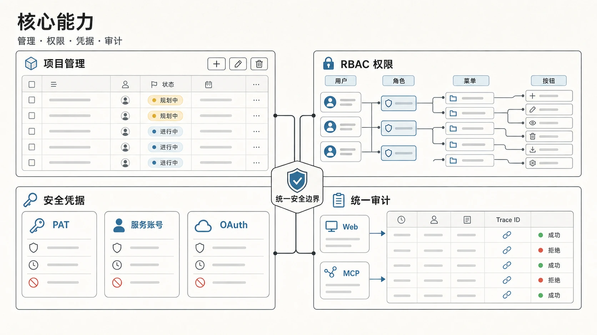
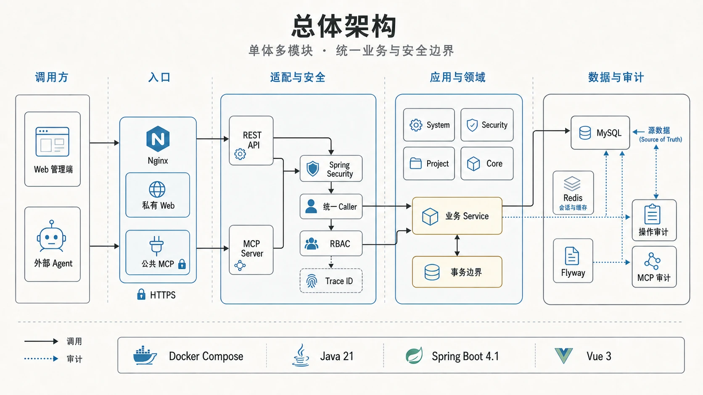
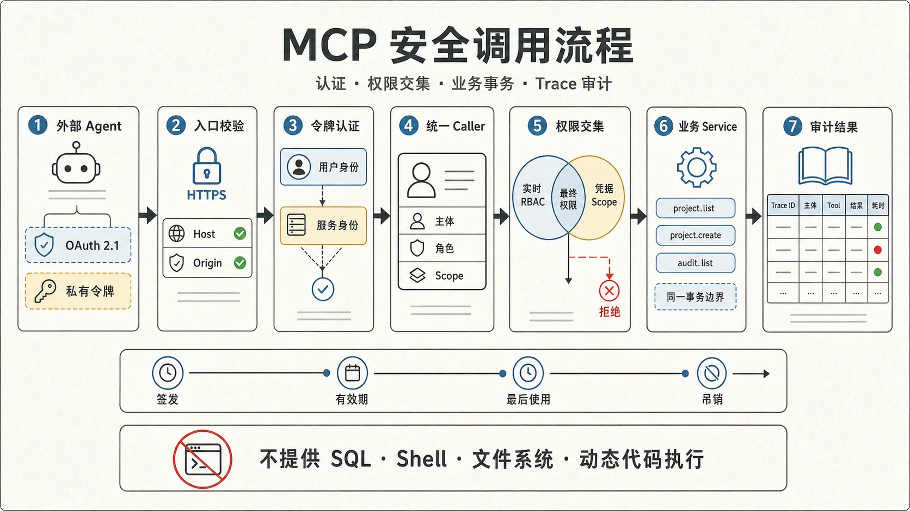

# 启程 Web Starter

[](https://github.com/mason2048/web-starter/actions/workflows/ci.yml)
[](LICENSE)



`web-starter` 是面向公司内部 Web 管理系统的通用脚手架。它采用模块化单体架构，在同一业务与安全边界内提供 Vue 管理端、REST API 和 MCP Server。

它不是绑定某个行业或业务流程的成品系统，而是一套可以复制、裁剪和继续开发的工程基线：管理端具备常用系统能力，REST 与 MCP 复用同一套业务服务、权限判断、事务和审计链路，部署配置也能从本地开发平滑过渡到内网环境。

## 项目状态

当前代码版本为 `2.0.0`。默认分支用于持续集成和社区协作；正式版本仍以注释 Git Tag、不可变镜像摘要和对应验收证据为准。构建通过不代表部署、迁移、认证或端到端流程已经在你的环境中通过。

## 管理端概览



上图为能力示意图。管理端围绕用户、角色、菜单与按钮权限、系统配置、审计日志和示例 Project CRUD 组织，可作为新业务模块的统一入口。

## 核心能力



- **统一安全基础**：Web Session、OAuth 访问令牌、PAT 和服务账号令牌最终映射为同一种调用方身份。
- **共享业务边界**：REST API 与 MCP Tool 调用相同的业务 Service，并共享事务、RBAC 和审计规则。
- **可复制示例模块**：Project 模块覆盖列表、详情、新增、修改、删除、权限、迁移和审计的完整链路。
- **面向实际部署**：提供 Docker Compose、Nginx、健康检查、环境变量配置和发布验收说明。

## 边界

- 面向内网管理系统，不提供公网自助注册、套餐、计费或 SaaS 多租户。
- Web API 与 MCP 共用业务 Service、数据库事务、实时 RBAC 和审计模型。
- 只提供 MCP Server，不连接或代理第三方 MCP Server。
- 不提供任意 SQL、Shell、文件系统或动态代码执行能力。
- 第一版保持单体部署，不引入微服务、服务发现和分布式事务。

## 技术基线

| 层 | 基线 |
|---|---|
| 前端 | Vue 3.5、TypeScript 5.9、Vite 8、Element Plus 2.14 |
| 后端 | Java 21、Spring Boot 4.1、Spring Security 7.1 |
| 数据访问 | MyBatis-Plus 3.5、MySQL 8.4、Flyway |
| 会话 | Spring Session、Redis 7.4 |
| MCP | MCP Java SDK 2.0、Streamable HTTP |
| 部署 | Docker Compose、Nginx |

## 模块

```text
web-starter
├── web-starter-core       # API、异常、Caller 与权限抽象
├── web-starter-system     # 用户、角色、菜单、配置、RBAC 与审计
├── web-starter-security   # Session、OAuth、PAT、服务账号令牌
├── web-starter-project    # 可复制的完整示例 CRUD
├── web-starter-mcp        # MCP Transport、Resources、Tools、Prompts
├── web-starter-admin      # Spring Boot 启动、Flyway 与运行时装配
├── web-starter-web        # Vue 管理端
├── deploy                 # Nginx 配置
└── docs                   # 架构、安全、部署与模块复制说明
```

依赖方向保持为：`admin -> mcp/security/project/system -> core`。MCP Tool 只能调用业务 Service，不能直接调用 Mapper。



架构图展示的是逻辑调用关系：Web 管理端和外部 Agent 从不同入口进入，在适配与安全层汇合为统一 Caller，再由共享业务 Service 访问 MySQL、Redis 和审计能力。

## 快速启动

需要 Docker Desktop 或 Docker Engine + Compose V2。

```bash
cp .env.example .env
```

替换 `.env` 中所有占位值。首次空库启动需要设置高强度 Bootstrap 管理员密码；项目不包含默认密码。

```bash
chmod 600 .env
./bin/web-starter doctor
./bin/web-starter up
```

`up` 会等待 MySQL、Redis、应用与 Nginx 全部达到就绪状态。日常停止使用 `./bin/web-starter down`，默认保留数据卷；删除数据卷必须显式选择并完成第二次确认。完整参数与安全边界见[离线生成与开发工具](docs/tooling.md)。

默认管理端地址为 `http://localhost:8088`。首次登录成功后，应移除 Bootstrap 密码环境变量并重建应用容器。

Actuator 的非健康端点不使用 Web 管理员 Session。`info`、`metrics`、`prometheus` 需要独立的 `WEB_STARTER_MANAGEMENT_USERNAME` / `WEB_STARTER_MANAGEMENT_PASSWORD`，生产缺失时拒绝启动；Nginx 不公开这些路径。具体采集和秘密处理要求见[部署与运维](docs/deployment.md#运维指标认证)，正式 V2 指标与 Trace 验收见[可观测性运行证据](docs/observability-runtime-evidence.md)。

本地分进程开发、可执行的 `compose.public-mcp.yaml` 双入口、独立无现场构建的 `compose.production.yaml`、TLS 证书挂载、备份恢复和 digest 回滚见 [部署说明](docs/deployment.md)。SBOM、实际 digest 扫描与漏洞例外规则见[供应链与发布镜像](docs/supply-chain.md)。公网入口必须使用 HTTPS，并且不能直接暴露标记为 `private` 的默认管理入口。

## 开发校验

统一证据采集入口是：

```bash
./bin/web-starter verify
```

它分别记录后端、前端、策略、容器、浏览器、OAuth 与 MCP 的状态；某层失败后继续采集后续证据。缺少真实运行环境或验收实现时会明确记录 `ENV_REQUIRED`/`NOT_COVERED` 并返回非零，而不会用构建成功代替全栈通过。以下命令仍可用于单层排查：

```bash
./mvnw verify

cd web-starter-web
pnpm install --frozen-lockfile
pnpm lint
pnpm typecheck
pnpm test
pnpm build

cd ..
python3 scripts/repository_policy.py secrets
```

根目录的 Maven Enforcer 要求 JDK 21 或更高的兼容构建 JDK，并始终以 `release 21` 产出字节码。部署镜像统一使用 Java 21 Runtime。

秘密与工程隔离门禁的本地用法、外部禁止词注入和退出码约定见 [仓库策略门禁](docs/repository-policy.md)。

## 安全模型

| 调用方 | 认证方式 | 入口建议 |
|---|---|---|
| Web 管理端 | 用户名/密码 + Redis Session + CSRF | 内网管理域名 |
| 外部用户 Agent | Authorization Code + PKCE | HTTPS 公共 MCP 域名 |
| 外部自动化 Agent | Client Credentials | HTTPS 公共 MCP 域名 |
| 内部固定 Agent | PAT 或服务账号令牌 | 受控私有入口 |

每个凭据最终映射为统一 `CurrentCaller`。令牌调用的最终授权结果为“主体实时 RBAC”与“令牌 Scope”的交集；禁用用户/服务账号、撤销令牌或回收角色权限会立即影响后续调用。

长期令牌只保存带 Pepper 版本的 HMAC-SHA-256 哈希和短提示，明文仅在创建响应中出现一次；旧 Pepper 验证成功后可事务迁移。OAuth Client Secret 支持有截止时间的 active/retiring 重叠轮换。外部入口由 Nginx 标记为 `public`，应用会拒绝 PAT 与服务账号长期令牌。详细威胁边界见 [安全模型](docs/security.md)。



每次 MCP 调用依次经过入口校验、令牌认证、统一 Caller 解析以及“实时 RBAC 与凭据 Scope 取交集”的最终授权，再进入业务事务并记录 Trace ID、调用结果和耗时。项目明确不提供任意 SQL、Shell、文件系统或动态代码执行工具。

## MCP Server

- 入口：`/mcp`
- 传输：Streamable HTTP
- Protected Resource Metadata：`/.well-known/oauth-protected-resource/mcp`

首版 Tools：

- `system.info`
- `project.list`
- `project.get`
- `project.create`
- `project.update`
- `project.remove`
- `audit.list`

首版还提供只读 Resource `web-starter://system/info`，以及 Prompt `project.summary`。每个入口都显式映射权限编码，并写入 MCP 调用日志；Project 写操作同时进入通用操作审计。

V2 Agent 调用 `project.create`、`project.update`、`project.remove` 时应提供 16–128 字符的 `idempotencyKey`。同一 Caller、Tool、Key 与参数的安全重试返回首次结果；同一 Key 配不同参数返回稳定冲突错误。为兼容 V1，过渡期仍接受不带 Key 的调用，但这类调用没有重试去重保证。数据库与审计只保存 Key 的 SHA-256 摘要，不保存明文 Key。

## 扩展

新增模块时以 `web-starter-project` 为模板，并遵循 [模块复制规范](docs/module-copy-guide.md)。数据库结构只能通过新的 Flyway 迁移演进，已应用迁移不得修改。

## 更多文档

- [贡献指南](CONTRIBUTING.md)
- [安全策略](SECURITY.md)
- [总体架构](docs/architecture.md)
- [V1 验收基线](docs/acceptance/v1-acceptance-baseline.md)
- [V1 验收证据模板](docs/acceptance/v1-evidence-template.md)
- [V1 验收记录（2026-07-19）](docs/acceptance/v1-acceptance-2026-07-19.md)
- [V2 验收基线](docs/acceptance/v2-acceptance-baseline.md)
- [V2 验收证据模板](docs/acceptance/v2-evidence-template.md)
- [V2-AC-01 冻结 V1 来源溯源证据](docs/v1-source-provenance-evidence.md)
- [固定 9+2 运行报告证据](docs/acceptance/release-runtime-test-reports.md)
- [V1 到 V2 兼容契约](docs/compatibility/v1-to-v2.md)
- [首版架构决策](docs/decisions/0001-foundation.md)
- [V2 工程产品化决策](docs/decisions/0002-v2-productization.md)
- [设计系统](docs/design-system.md)
- [部署与运维](docs/deployment.md)
- [安全模型](docs/security.md)
- [仓库策略门禁](docs/repository-policy.md)
- [供应链与发布镜像](docs/supply-chain.md)
- [模块复制规范](docs/module-copy-guide.md)
- [派生项目与生成模块验收演练](docs/generator-acceptance-rehearsal.md)

## 许可证

本项目采用 [Apache License 2.0](LICENSE) 开源。
