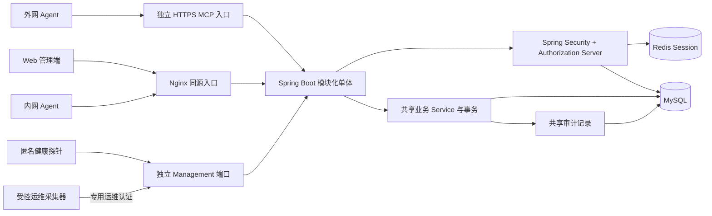
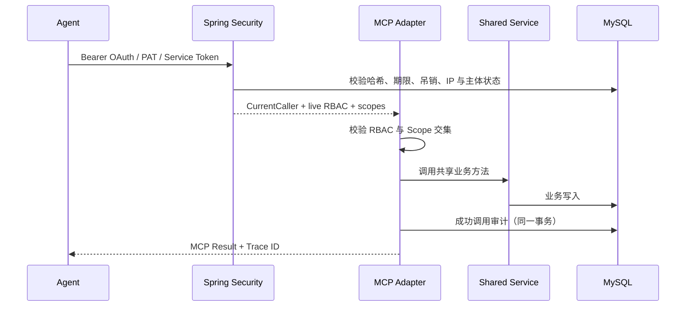

# 总体架构

本文描述首版已经落地的边界、模块依赖、数据模型和权限映射。它是后续扩展的约束，不是微服务拆分计划。

## 产品范围

`web-starter` 用于快速建立公司内部 Web 管理系统，同时向受控 Agent 提供 MCP Server。首版包含：

- 登录、退出、Redis Session 与 CSRF；
- 用户、角色、权限、菜单和系统配置；
- 登录日志、操作日志和 MCP 调用日志；
- 一个完整的项目 CRUD 示例；
- PAT、服务账号令牌和内置 OAuth 2.1 Authorization Server；
- MCP Streamable HTTP，以及固定的 Resources、Tools 和 Prompts；
- Flyway、Docker Compose、Nginx、健康检查和运维文档。

首版明确不包含公网注册、SaaS 多租户、套餐计费、MCP Client、工具市场、微服务、服务发现、分布式事务、聊天页面，以及任意 SQL、Shell、文件系统或动态代码执行。

## 运行时结构

Web Controller 和 MCP Tool 只负责协议适配，都调用同一 Service。权限校验位于 Service 或统一 MCP 调用边界；Mapper 不向协议层直接暴露。写业务数据和成功审计记录处于同一事务，失败调用使用独立事务保留审计证据。

Management 端口不属于 Web 或 MCP 调用面。健康探针匿名，`info`、`metrics`、`prometheus` 使用独立无状态 Spring Security 身份；Web Session、OAuth、PAT 和服务账号都不能自然获得该权限。两个 Nginx 入口不代理非健康运维端点。

## Maven 模块

| 模块 | 职责 | 允许依赖 |
|---|---|---|
| `web-starter-core` | API 信封、分页、异常、Caller、权限与 Trace 抽象 | 无业务模块 |
| `web-starter-system` | 用户、角色、权限、菜单、配置、身份快照、三类审计 | `core` |
| `web-starter-security` | Web Session、CSRF、PAT、服务账号、OAuth AS/RS | `core`、`system` |
| `web-starter-project` | 可复制的项目 CRUD 示例 | `core`、`system` |
| `web-starter-mcp` | Streamable HTTP、Tools、Resources、Prompts | `core`、`system`、`security`、`project` |
| `web-starter-admin` | 启动、配置、Flyway、过滤器和运行时装配 | 所有后端模块 |

`web-starter-web` 是独立的 Vue 工程，通过同源 `/api` 与后端交互。新增业务模块遵循 `admin -> feature -> system/core` 的单向依赖，不允许 feature 之间形成循环依赖。

## 核心数据模型

| 表 | 用途 | 关键约束 |
|---|---|---|
| `sys_user` | Web 用户 | 用户名唯一、逻辑删除、乐观锁版本 |
| `sys_role` | RBAC 角色 | 角色编码唯一、逻辑删除、乐观锁版本 |
| `sys_permission` | 稳定权限字典 | 权限编码唯一 |
| `sys_menu` | 菜单与按钮元数据 | 父子关系、可选权限编码 |
| `sys_user_role` | 用户与角色关系 | 联合主键 |
| `sys_role_permission` | 角色与权限关系 | 联合主键 |
| `sys_role_menu` | 角色与菜单关系 | 联合主键 |
| `sys_config` | 非敏感运行配置 | 配置键唯一，拒绝敏感键名 |
| `sys_login_log` | 登录成功与失败记录 | 用户名、IP、结果、Trace ID |
| `sys_operation_log` | Web/业务写操作审计 | 主体、资源、结果、Trace ID |
| `sys_mcp_call_log` | MCP 调用审计 | Tool、权限、凭据、结果、Trace ID |
| `biz_project` | 示例项目 | 项目编码唯一、逻辑删除、乐观锁版本 |
| `sec_service_account` | 自动化主体 | 角色集合、启停状态 |
| `sec_access_credential` | PAT 与服务账号长期令牌 | 只存带 Pepper 版本的 HMAC 哈希、Scope、期限、IP、吊销/最后使用时间 |
| `sec_oauth_client` | 预注册 OAuth Client | Grant、认证方式、Redirect URI、Scope、服务账号绑定，以及 active/retiring Secret 哈希版本和截止时间 |
| `sec_oauth_token_registry` | 短时 OAuth Token 撤销登记 | 只存 JTI 哈希，不保存 Bearer Token |
| `oauth2_authorization` | Authorization Server 协议状态 | code/state/token 值在持久化前哈希 |
| `oauth2_authorization_consent` | 用户授权同意 | Client 与用户联合主键 |

所有时间按数据库/服务端 UTC 语义存储，API 根据统一 Jackson 时区展示。数据库结构只允许通过递增 Flyway 迁移演进。

## 权限矩阵

| 能力 | Web 权限 | MCP Tool | MCP Scope |
|---|---|---|---|
| 查看系统信息 | `system:info` | `system.info` | `system:info` |
| 项目列表/详情 | `project:list` | `project.list`、`project.get` | `project:list` |
| 创建项目 | `project:create` | `project.create` | `project:create` |
| 更新项目 | `project:update` | `project.update` | `project:update` |
| 删除项目 | `project:remove` | `project.remove` | `project:remove` |
| 查看审计 | `audit:list` | `audit.list` | `audit:list` |
| 用户管理 | `system:user:*` | 不暴露 | 不适用 |
| 角色管理 | `system:role:*` | 不暴露 | 不适用 |
| 权限字典 | `system:permission:*` | 不暴露 | 不适用 |
| 菜单管理 | `system:menu:*` | 不暴露 | 不适用 |
| 系统配置 | `system:config:*` | 不暴露 | 不适用 |
| 个人令牌 | `security:personal-token:*` | 不暴露 | 不适用 |
| 服务账号 | `security:service-account:manage` | 不暴露 | 不适用 |
| OAuth Client | `security:oauth-client:manage` | 不暴露 | 不适用 |

Web Session 使用实时 RBAC。所有令牌调用使用 `实时主体 RBAC ∩ 令牌 Scope`；两边都允许才通过。菜单可见性只改善界面体验，不替代后端授权。

## MCP 内容

### Resources

- `web-starter://system/info`：只读、非敏感的产品和运行时摘要，要求 `system:info`。

### Tools

- `system.info`
- `project.list`
- `project.get`
- `project.create`
- `project.update`
- `project.remove`
- `audit.list`

每个 Tool 使用固定 JSON Schema、显式权限编码和输入校验。项目工具复用 `ProjectService`，不直接访问 Mapper。

### Prompts

- `project.summary`：生成项目摘要任务模板。项目名称和描述作为不可信数据引用，不允许其中内容改变系统指令或触发额外能力。

## 认证与审计序列

外部用户 Agent 使用 Authorization Code + PKCE；外部自动化使用 Client Credentials；受控内网 Agent 才能使用长期 PAT 或服务账号令牌。公网入口强制 HTTPS 并标记 `public`，应用拒绝该入口上的长期令牌。

## 示例业务边界

项目示例只演示通用 CRUD 技术模式：分页列表、详情、创建、更新、逻辑删除、状态筛选、负责人、Bean Validation、唯一编码、乐观锁、RBAC、Web 与 MCP 共用 Service、事务和审计。它不承载任何具体公司的业务流程，也不是项目管理产品。

## 部署边界

默认 Compose 运行 Nginx、Spring Boot、MySQL 和 Redis。Nginx 是唯一面向使用者的端口，数据网络默认隔离；开发覆盖文件只把依赖端口绑定到 `127.0.0.1`。外网 MCP 使用独立的最小暴露虚拟主机，不公开完整管理 API。

## 后续决策点

以下内容不阻塞首版，但生产采用前需由部署方明确：

- OAuth Issuer 的正式 HTTPS 域名、证书和可信代理链；
- RSA 密钥托管、轮换窗口和灾备恢复流程；
- 审计日志保留期、归档位置和访问审批；
- PAT 是否在具体部署中完全关闭，或仅允许堡垒网络；
- IP 限制以哪一层代理解析后的客户端地址为准；
- 备份频率、RPO/RTO 和恢复演练责任人。
